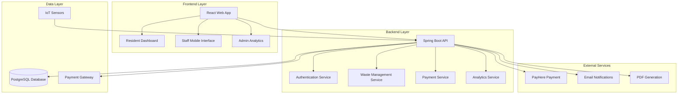

# 🗑️ Smart Waste Management System

<div align="center">


**A comprehensive waste management platform with IoT integration, analytics, and multi-role support**

[](https://openjdk.java.net/)
[](https://spring.io/projects/spring-boot)
[](https://reactjs.org/)
[](https://postgresql.org/)
[](https://vitejs.dev/)

[](LICENSE)
[](https://github.com/yourusername/smart-waste-management)

</div>

---

## 📋 Table of Contents

- [✨ Overview](#-overview)
- [🏗️ System Architecture](#️-system-architecture)
- [🚀 Features](#-features)
- [🛠️ Tech Stack](#️-tech-stack)
- [📦 Installation & Setup](#-installation--setup)
- [🎯 Usage](#-usage)
- [👥 User Roles](#-user-roles)
- [📊 Analytics & Reporting](#-analytics--reporting)
- [🔧 API Documentation](#-api-documentation)
- [📁 Project Structure](#-project-structure)
- [🔄 Development Workflow](#-development-workflow)
- [🚀 Deployment](#-deployment)
- [🤝 Contributing](#-contributing)
- [📄 License](#-license)

---

## ✨ Overview

The **Smart Waste Management System** is a comprehensive platform designed to modernize waste collection and management processes. It integrates IoT sensors, mobile applications, and web dashboards to provide real-time monitoring, automated billing, and data-driven insights for efficient waste management operations.

### 🎯 Key Benefits

- **🌱 Environmental Impact**: Promotes recycling through PAYT (Pay-As-You-Throw) incentives
- **💰 Cost Efficiency**: Automated billing and optimized collection routes
- **📊 Data-Driven**: Real-time analytics and reporting for better decision making
- **🔧 Scalable**: Multi-tenant architecture supporting multiple cities
- **📱 User-Friendly**: Intuitive interfaces for residents, staff, and administrators

---

## 🏗️ System Architecture



### 🏛️ Architecture Principles

- **🎯 SOLID Principles**: Clean, maintainable code following SOLID design principles
- **🔄 Design Patterns**: Strategy and Observer patterns for analytics and notifications
- **🔒 Security**: JWT-based authentication with role-based access control
- **📈 Scalability**: Microservice-ready architecture with clear separation of concerns
- **🛡️ Error Handling**: Comprehensive error handling and user feedback systems

---

## 🚀 Features

### 🏠 **Resident Features**
- 📊 **Personal Dashboard**: Real-time bin status, billing overview, and collection history
- 🗑️ **Bin Management**: Monitor multiple waste bins with different types (General, Recyclable, Organic, E-waste)
- 📅 **Collection Scheduling**: Request waste collection pickups with flexible scheduling
- 💰 **Billing & Payments**: View invoices, track recycling credits, and make payments via PayHere
- ♻️ **Recycling Incentives**: Earn credits for recyclable waste through PAYT system
- 📱 **Mobile-Friendly**: Responsive design for mobile and tablet access

### 👷 **Staff Features**
- 📱 **Mobile Collection App**: Scan QR codes, record collections, and update bin levels
- 🚛 **Collection Management**: Track assigned collections and update status in real-time
- 📊 **Performance Dashboard**: View collection statistics and performance metrics
- 🔄 **Offline Support**: Continue working without internet connection
- 📋 **Collection Reports**: Generate detailed reports for completed collections

### 👨‍💼 **Admin Features**
- 📈 **Analytics Dashboard**: Comprehensive KPIs, trends, and performance metrics
- 👥 **User Management**: Manage residents, staff, and system administrators
- 💰 **Billing Management**: Configure city-specific billing models (Weight-based, Flat fee, Hybrid)
- 🗑️ **Bin Monitoring**: Real-time monitoring of all waste bins across the city
- 📊 **Collection Reports**: Detailed reports on collection efficiency and revenue
- 🧾 **Invoice Management**: Track payments, generate reports, and manage billing cycles
- 📅 **Schedule Management**: Oversee collection schedules and optimize routes

### 🔧 **System Features**
- 🔐 **Multi-Role Authentication**: Secure login with role-based access control
- 📊 **Real-time Analytics**: Live data processing with Strategy and Observer patterns
- 💳 **Payment Integration**: Secure payment processing via PayHere gateway
- 📧 **Notification System**: Automated notifications for collections, payments, and alerts
- 📄 **Report Generation**: PDF and CSV export capabilities for all data
- 🌐 **Multi-City Support**: Configurable billing models for different cities
- 🔄 **Auto-Scheduling**: Intelligent collection scheduling based on bin levels

---

## 🛠️ Tech Stack

### **Backend Technologies**
| Technology | Version | Purpose |
|------------|---------|---------|
|  | 17 | Core application language |
|  | 3.5.6 | Application framework |
|  | 6.x | Authentication & authorization |
|  | 3.x | Data persistence |
|  | 15+ | Primary database |
|  | 1.18+ | Code generation |
|  | 3.9+ | Build tool |

### **Frontend Technologies**
| Technology | Version | Purpose |
|------------|---------|---------|
|  | 19.1.1 | UI framework |
|  | 7.1.7 | Build tool & dev server |
|  | 7.9.4 | Client-side routing |
|  | 1.12.2 | HTTP client |
|  | 4.5.1 | Data visualization |
|  | 2.6.0 | Notifications |
|  | 3.0.3 | PDF generation |
|  | 1.4.1 | Screenshot capture |

### **External Services**
| Service | Purpose |
|---------|---------|
|  | Payment processing |
|  | Development tunneling |

---

## 📦 Installation & Setup

### **Prerequisites**

- ☕ **Java 17** or higher
- 🐘 **PostgreSQL 15+** 
- 📦 **Node.js 18+** and npm
- 🔧 **Maven 3.9+**

### **1. Clone the Repository**

```bash
git clone https://github.com/yourusername/smart-waste-management.git
cd smart-waste-management
```

### **2. Database Setup**

```bash
# Create PostgreSQL database
createdb waste

# Or using psql
psql -U postgres
CREATE DATABASE waste;
\q
```

### **3. Backend Setup**

```bash
# Navigate to project root
cd smart-waste-management

# Update application.properties with your database credentials
# Edit: src/main/resources/application.properties
```

**Configure Database Connection:**
```properties
# Database Configuration
spring.datasource.url=jdbc:postgresql://localhost:5432/waste
spring.datasource.username=your_username
spring.datasource.password=your_password
```

```bash
# Build and run the backend
./mvnw clean install
./mvnw spring-boot:run
```

**Backend will be available at:** `http://localhost:8082`

### **4. Frontend Setup**

```bash
# Navigate to frontend directory
cd frontend

# Install dependencies
npm install

# Start development server
npm run dev
```

**Frontend will be available at:** `http://localhost:5173`

### **5. Environment Configuration**

Create a `.env` file in the frontend directory:

```env
VITE_API_BASE_URL=http://localhost:8082
VITE_PAYHERE_MERCHANT_ID=your_merchant_id
VITE_PAYHERE_SECRET=your_merchant_secret
```

---

## 🎯 Usage

### **🚀 Quick Start**

1. **Access the Application**
   - Open `http://localhost:5173` in your browser
   - Register as a new user or use existing credentials

2. **Default User Roles**
   - **Resident**: Register with `ROLE_RESIDENT`
   - **Staff**: Register with `ROLE_STAFF` 
   - **Admin**: Register with `ROLE_ADMIN`

3. **First-Time Setup**
   - Admin users can create billing models for their city
   - Staff users can start recording collections
   - Residents can view their dashboard and manage bins

### **📱 Mobile Usage**

The application is fully responsive and works on mobile devices. Staff members can use their smartphones to:
- Scan QR codes on waste bins
- Record collection data
- Update bin levels
- View collection history

### **🔄 Development Commands**

```bash
# Backend Development
./mvnw spring-boot:run          # Run backend server
./mvnw test                     # Run backend tests
./mvnw clean package           # Build backend JAR

# Frontend Development  
npm run dev                     # Start development server
npm run build                   # Build for production
npm run preview                 # Preview production build
npm run lint                    # Run ESLint
```

---

## 👥 User Roles

### 🏠 **Resident Role** (`ROLE_RESIDENT`)
- **Purpose**: Household and business waste management
- **Key Features**:
  - View personal dashboard with bin status and billing
  - Schedule waste collection pickups
  - Track recycling credits and savings
  - Make payments for waste services
  - Monitor collection history

### 👷 **Staff Role** (`ROLE_STAFF`)
- **Purpose**: Waste collection and field operations
- **Key Features**:
  - Mobile collection app with QR code scanning
  - Record collection data and weights
  - Update bin levels and status
  - View assigned collection schedules
  - Generate collection reports

### 👨‍💼 **Admin Role** (`ROLE_ADMIN`)
- **Purpose**: System administration and oversight
- **Key Features**:
  - Comprehensive analytics dashboard
  - User management (residents, staff, admins)
  - Billing model configuration
  - System-wide monitoring and reporting
  - Financial oversight and invoice management

### 🏙️ **City Manager Role** (`ROLE_CITY_MANAGER`)
- **Purpose**: City-specific configuration and management
- **Key Features**:
  - Configure billing models per city
  - Manage city-specific waste policies
  - Oversee regional operations

---

## 📊 Analytics & Reporting

### **📈 Real-time Analytics Dashboard**

The system includes a comprehensive analytics dashboard with:

- **📊 Key Performance Indicators (KPIs)**
  - Total waste collected
  - Collection efficiency metrics
  - Revenue tracking
  - Recycling rates

- **📅 Time-based Filtering**
  - Last 7 days
  - Last 30 days  
  - All-time data
  - Custom date ranges

- **📋 Collection Records**
  - Detailed collection history
  - Staff performance metrics
  - Bin utilization statistics
  - Geographic distribution

### **📄 Report Generation**

- **📊 CSV Export**: Collection data, billing reports, user statistics
- **📄 PDF Reports**: Invoices, collection summaries, analytics reports
- **📈 Charts & Graphs**: Visual representation of trends and patterns

### **🔍 Data Visualization**

- **📊 Chart.js Integration**: Interactive charts and graphs
- **📱 Responsive Design**: Analytics accessible on all devices
- **🔄 Real-time Updates**: Live data refresh capabilities

---

## 🔧 API Documentation

### **🔐 Authentication Endpoints**

```http
POST /api/auth/register
POST /api/auth/login
GET  /api/auth/users/role/{role}
```

### **🗑️ Waste Management Endpoints**

```http
# Bin Management
GET    /api/waste/bins/resident/{residentId}
PUT    /api/waste/bins/{binId}/level
GET    /api/waste/bins/{binId}

# Collection Management  
POST   /api/waste/collections/record
GET    /api/waste/collections/collector/{collectorId}
GET    /api/waste/collections/stats/total-waste

# Schedule Management
POST   /api/waste/schedules/create
GET    /api/waste/schedules/resident/{residentId}
PUT    /api/waste/schedules/{scheduleId}/status
```

### **💰 Payment & Billing Endpoints**

```http
# Invoice Management
GET    /api/invoices/resident/{residentId}
GET    /api/invoices/admin/pending
POST   /api/invoices/generate

# Payment Processing
POST   /api/payments/process
GET    /api/payments/history/{userId}

# Billing Models
POST   /api/billing/models
GET    /api/billing/models/city/{city}
PUT    /api/billing/models/{modelId}
```

### **📊 Analytics Endpoints**

```http
GET    /api/waste/analytics?range={range}
GET    /api/waste/analytics/kpis?range={range}
GET    /api/waste/analytics/monthly?range={range}
GET    /api/waste/analytics/collections?range={range}
GET    /api/waste/analytics/export?range={range}&format=csv
```

---

## 📁 Project Structure

```
Smart-Waste-Management/
├── 📁 frontend/                          # React frontend application
│   ├── 📁 src/
│   │   ├── 📁 components/               # Reusable UI components
│   │   │   ├── AdminLayout.jsx          # Admin dashboard layout
│   │   │   ├── Layout.jsx               # Main application layout
│   │   │   ├── Sidebar.jsx              # Navigation sidebar
│   │   │   └── StaffLayout.jsx          # Staff interface layout
│   │   ├── 📁 pages/                    # Page components
│   │   │   ├── 📁 admin/                # Admin-specific pages
│   │   │   │   ├── AdminDashboard.jsx   # Admin overview
│   │   │   │   ├── AdminAnalyticsDashboard.jsx # Analytics dashboard
│   │   │   │   ├── BillingManagement.jsx # Billing configuration
│   │   │   │   ├── BinMonitoring.jsx    # Bin monitoring
│   │   │   │   ├── CollectionReports.jsx # Collection reports
│   │   │   │   ├── InvoicesPayments.jsx # Invoice management
│   │   │   │   ├── ScheduleManagement.jsx # Schedule oversight
│   │   │   │   └── UserManagement.jsx   # User administration
│   │   │   ├── Dashboard.jsx            # Resident dashboard
│   │   │   ├── Login.jsx                # Authentication
│   │   │   ├── Register.jsx             # User registration
│   │   │   ├── StaffDashboard.jsx       # Staff interface
│   │   │   ├── StaffScan.jsx            # QR code scanning
│   │   │   └── StaffScanOffline.jsx     # Offline collection
│   │   ├── 📁 services/                 # API service layer
│   │   │   └── analyticsService.js      # Analytics API calls
│   │   ├── App.jsx                      # Main application component
│   │   └── main.jsx                     # Application entry point
│   ├── package.json                     # Frontend dependencies
│   └── vite.config.js                   # Vite configuration
├── 📁 src/main/java/com/CSSEProject/SmartWasteManagement/
│   ├── 📁 analytics/                    # Analytics module
│   │   ├── 📁 controller/               # Analytics REST controllers
│   │   ├── 📁 dto/                      # Data transfer objects
│   │   ├── 📁 observer/                 # Observer pattern implementation
│   │   ├── 📁 service/                  # Analytics business logic
│   │   └── 📁 strategy/                 # Strategy pattern for filtering
│   ├── 📁 config/                       # Configuration classes
│   │   ├── DatabaseChecker.java         # Database health check
│   │   ├── SecurityConfig.java          # Security configuration
│   │   └── WebConfig.java               # Web configuration
│   ├── 📁 controller/                   # Main REST controllers
│   │   ├── AuthController.java          # Authentication endpoints
│   │   └── TestController.java          # Testing endpoints
│   ├── 📁 dto/                          # Data transfer objects
│   ├── 📁 payment/                      # Payment module
│   │   ├── 📁 controller/               # Payment controllers
│   │   ├── 📁 entity/                   # Payment entities
│   │   ├── 📁 repository/               # Payment repositories
│   │   └── 📁 service/                  # Payment services
│   ├── 📁 reporting/                    # Reporting module
│   ├── 📁 staff/                        # Staff management
│   ├── 📁 user/                         # User management
│   │   ├── 📁 entity/                   # User entities
│   │   ├── 📁 repository/               # User repositories
│   │   └── 📁 service/                  # User services
│   ├── 📁 waste/                        # Waste management core
│   │   ├── 📁 controller/               # Waste controllers
│   │   ├── 📁 entity/                   # Waste entities
│   │   ├── 📁 repository/               # Waste repositories
│   │   └── 📁 service/                  # Waste services
│   └── SmartWasteManagementApplication.java # Main application class
├── 📁 src/main/resources/
│   └── application.properties           # Application configuration
├── 📁 src/test/                         # Test files
├── pom.xml                              # Maven configuration
├── README.md                            # This file
├── ANALYTICS_DASHBOARD_IMPLEMENTATION.md # Analytics documentation
├── FIXES_SUMMARY.md                     # Bug fixes documentation
└── TEST_IMPLEMENTATION_SUMMARY.md       # Testing documentation
```

---

## 🔄 Development Workflow

### **🔄 Git Workflow**

```bash
# Create feature branch
git checkout -b feature/new-feature

# Make changes and commit
git add .
git commit -m "feat: add new feature"

# Push and create pull request
git push origin feature/new-feature
```

### **🧪 Testing**

```bash
# Backend Tests
./mvnw test

# Frontend Tests (when implemented)
cd frontend
npm test
```

### **📝 Code Standards**

- **Java**: Follow Spring Boot conventions and SOLID principles
- **React**: Use functional components with hooks
- **CSS**: Use consistent naming conventions
- **Git**: Use conventional commit messages

---

## 🚀 Deployment

### **🐳 Docker Deployment** (Recommended)

```dockerfile
# Backend Dockerfile
FROM openjdk:17-jdk-slim
COPY target/SmartWasteManagement-0.0.1-SNAPSHOT.jar app.jar
EXPOSE 8082
ENTRYPOINT ["java", "-jar", "/app.jar"]
```

```dockerfile
# Frontend Dockerfile  
FROM node:18-alpine
WORKDIR /app
COPY package*.json ./
RUN npm install
COPY . .
RUN npm run build
EXPOSE 5173
CMD ["npm", "run", "preview"]
```

### **☁️ Cloud Deployment**

- **Backend**: Deploy to AWS ECS, Google Cloud Run, or Azure Container Instances
- **Frontend**: Deploy to Vercel, Netlify, or AWS S3 + CloudFront
- **Database**: Use managed PostgreSQL (AWS RDS, Google Cloud SQL, Azure Database)

### **🔧 Production Configuration**

```properties
# Production application.properties
spring.profiles.active=production
spring.datasource.url=${DATABASE_URL}
spring.datasource.username=${DB_USERNAME}
spring.datasource.password=${DB_PASSWORD}
payhere.mode=live
payhere.merchant.id=${PAYHERE_MERCHANT_ID}
payhere.merchant.secret=${PAYHERE_SECRET}
```

---

## 🤝 Contributing

We welcome contributions! Please follow these steps:

### **🔧 Development Setup**

1. **Fork the repository**
2. **Clone your fork**
   ```bash
   git clone https://github.com/yourusername/smart-waste-management.git
   ```
3. **Create a feature branch**
   ```bash
   git checkout -b feature/amazing-feature
   ```
4. **Make your changes**
5. **Test your changes**
6. **Commit your changes**
   ```bash
   git commit -m "feat: add amazing feature"
   ```
7. **Push to your fork**
   ```bash
   git push origin feature/amazing-feature
   ```
8. **Open a Pull Request**

### **📋 Contribution Guidelines**

- 🎯 **Follow SOLID principles** in backend development
- 📱 **Ensure mobile responsiveness** for frontend changes
- 🧪 **Add tests** for new features
- 📝 **Update documentation** for API changes
- 🔍 **Test thoroughly** before submitting

### **🐛 Bug Reports**

When reporting bugs, please include:
- 🖥️ **Environment details** (OS, browser, Java version)
- 📝 **Steps to reproduce**
- 🎯 **Expected vs actual behavior**
- 📷 **Screenshots** (if applicable)

---

## 📄 License

This project is licensed under the **MIT License** - see the [LICENSE](LICENSE) file for details.

---

## 📞 Support & Contact

- 📧 **Email**: support@smartwastemanagement.com
- 🐛 **Issues**: [GitHub Issues](https://github.com/yourusername/smart-waste-management/issues)
- 💬 **Discussions**: [GitHub Discussions](https://github.com/yourusername/smart-waste-management/discussions)
- 📖 **Documentation**: [Wiki](https://github.com/yourusername/smart-waste-management/wiki)

---

<div align="center">

**Made with ❤️ for a cleaner, smarter future**


[⬆ Back to Top](#-smart-waste-management-system)

</div>